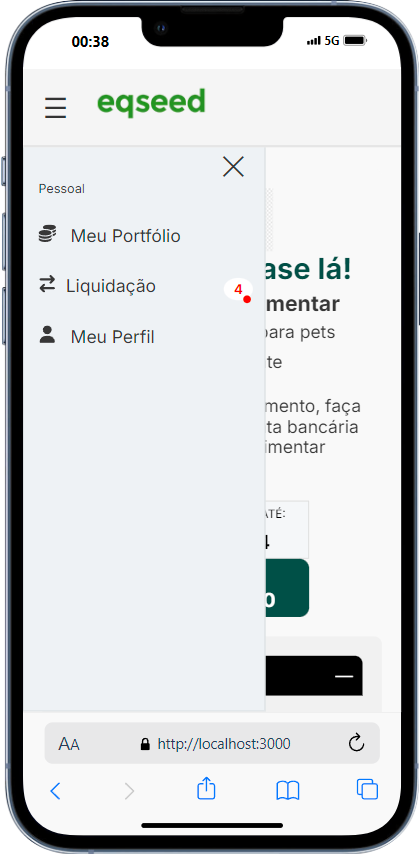

💻 Sobre o projeto

🔔 Página de Liquidação de Ofertas 💻

## Descrição

Página web para a liquidação de ofertas de investimento. Esta página exibi as informações de 
ofertas retornadas por um endpoint de API e permitir que o investidor visualize os detalhes 
de cada oferta e faça o upload dos comprovantes de pagamento.

<br>
<hr>
<div align="center">
	<div style="margin-right: 10px;">
			
	</div>
	<div>
		
	</div>
  <br>
  
</div>
<hr>
<br>

## Estrutura

    Sale-Page
    ├── src                            (Diretório principal dos arquivos do projeto)
    │   ├── assets                     (Recursos de folhas de estilo, scripts, fontes e imagens)
    │   ├── components                 (Componentes que não possuem estados, são chamados de dummy components)
    │   ├── services                    (Utilizado para transferir dados através de protocolos de comunicação para diferentes plataformas)
    ├── README.md                      (Breve definição/Documentação)
    └── ...                            (Outros arquivos de configuração)

### Ferramentas

- [NextJS](https://nextjs.org/)

- [StyledComponents](https://styled-components.com/)

- [TypeScript](https://www.typescriptlang.org/)

- [Axios](https://axios-http.com/ptbr/docs/intro)

- [Git](https://git-scm.com/doc)

### Montagem do ambiente de desenvolvimento

O primeiro passo é clonar o projeto utilizando o método HTTPS ou SSH.

SSH

```sh
git clone git@github.com:eosantos/sale-page.git
```

HTTPS

```sh
git clone https://github.com/eosantos/sale-page.git
```

### Instalar dependências do projeto

Com o comando abaixo instalamos todos os pacotes definidos no package.json para configuração do servidor local:

```sh
npm i
```

### Acessando a aplicação

Para iniciar o projeto basta executar o comando abaixo:

```sh
npm run dev
```
Após a execução do comando acima basta abrir o link `http://localhost:3000`.
